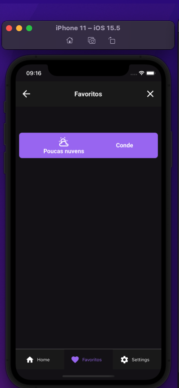
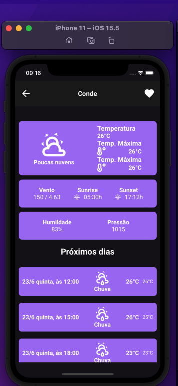
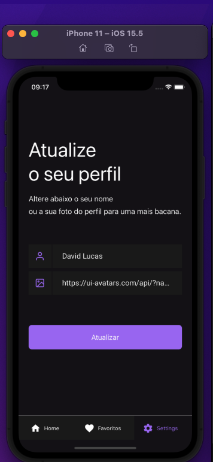

# Weather App

> Projeto com intuito de mostrar a previsão do tempo ao usuário, dado sua localidade atual e localiades que ele possa pesquisar

### Funcionalidades

O projeto ainda está em desenvolvimento, mas já conta com algumas funcionalidades:

- [x] Selecionar localidade atual através do GPS do usuário
- [x] Buscar localidades por cidade
- [x] Visualizar com detalhes a previsão do tempo de uma localidade selecionada
- [x] Adiconar aos favoritos
- [x] Remover dos favoritos
- [x] Login simples com nome e uma imagem (não obrigatório)
- [x] Editar suas informações

## 💻 Pré-requisitos

Antes de começar, verifique se você atendeu aos seguintes requisitos:

- Você possuir o Node instalado com a versão minima 16.13.2
- Você possuir o Expo instalando em sua máquina
- Você possuir o yarn instalando em sua máquina

## 🚀 Instalando `Weather App`

Para instalar o App, siga estas etapas:

Faça o clone do repositório

```
git clone https://github.com/thereallucas98/weather-app.git
```

Instale as dependências

```
yarn
```

Executar o Aplicativo

```
expo start
```

Por está sendo utilizando o Expo, você pode utilizar ou algum device do Android Studio ou instalar o Expo no seu dispositivo móvel e ler o QRCode

## Preview 🖼️

# Tela de Login


# Tela de Login preenchida


# Tela Home


# Tela de Favoritos


# Tela de Clima em Detalhes


# Tela de Editar Usuário


